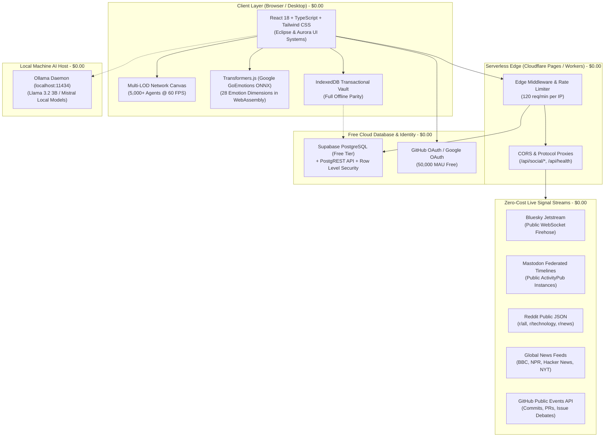

# Social Gravity — Computational Social Psychology Engine

> **A zero-cost, open-source decision intelligence engine for simulating, analyzing, and inoculating against information contagion, echo-chamber polarization, and viral rumor cascades.**

[](#zero-cost-production-budget)
[](https://github.com/Poleter69/social-gravity-/actions/workflows/ci.yml)
[](https://pages.cloudflare.com/)
[](https://pages.github.com/)
[](https://supabase.com/)
[-3178C6.svg?logo=typescript)](https://www.typescriptlang.org/)
[](https://vitejs.dev/)
[](https://tailwindcss.com/)
[](tests/runAll.ts)
[](LICENSE)

---

## 1. Executive Summary & The Zero-Cost Rule

**Social Gravity** transforms high-level social network theory (Asch conformity, Granovetter threshold models, dual-process cognitive deliberation) into an interactive, real-time computational sandbox. It enables researchers, intelligence analysts, and open-source investigators to model how rumors propagate, identify super-spreader nodes, detect algorithmic echo chambers, and discover mathematically optimal counter-interventions.

### The Primary Architectural Invariant: Zero-Cost Production
**Every architectural decision prioritizes free, production-usable infrastructure ($0.00/month).**
- **Zero Mandatory Paid Services**: Never requires OpenAI API keys, paid social data licenses (like X's paid API), or paid cloud compute.
- **Client & Edge Native**: Heavy neural classification runs on the client via **Transformers.js** (WebGPU/WebAssembly ONNX) or locally via **Ollama**.
- **Free Live Ingestion**: Leverages open federated protocols (**Bluesky AT Protocol Jetstream**, **Mastodon ActivityPub**, **Reddit Public JSON**, **Global RSS**, and **GitHub Public Events**).
- **Serverless & Sleep-Safe**: Deploys to **Cloudflare Pages** and **GitHub Pages** with auto-scaling to zero and instant waking.

---

## 2. Zero-Cost Production Budget ($0.00 / Month)

| Infrastructure Component | Service Provider | Free-Tier Allocation | Monthly Cost |
|---|---|---|---|
| **Web Hosting & CDN** | Cloudflare Pages / GitHub Pages | Unlimited bandwidth, worldwide edge CDN | **$0.00** |
| **Edge Serverless Compute** | Cloudflare Pages Functions | 100,000 requests/day, 10ms CPU per request | **$0.00** |
| **Relational Database** | Supabase Free / Neon Serverless | 500MB PostgreSQL, unlimited PostgREST reads | **$0.00** |
| **Authentication** | Supabase Auth (GitHub & Google OAuth) | 50,000 Monthly Active Users (MAU) | **$0.00** |
| **Object Storage** | Supabase Storage / Client Vault | 1GB cloud bucket + unlimited IndexedDB | **$0.00** |
| **AI Emotion Inference** | Transformers.js (GoEmotions ONNX) | Client-side CPU/WebGPU browser execution | **$0.00** |
| **Deep Qualitative AI** | Local Ollama (`llama3.2:3b` on host) | 100% free local host compute | **$0.00** |
| **Social Data Streams** | AT Protocol, ActivityPub, RSS, GitHub | Free public APIs, WebSockets & RSS feeds | **$0.00** |
| **CI/CD Automation** | GitHub Actions | 2,000 runner minutes/month | **$0.00** |
| **Health Monitoring** | UptimeRobot Free + Cloudflare Analytics | 50 HTTP monitors, 5-min intervals, zero-cookie telemetry | **$0.00** |
| **Total Monthly Cost** | | **Full Production Deployment** | **$0.00 / month** |

---

## 3. Architecture Overview



---

## 4. Key Capabilities

### 🔬 Empirical Social Contagion & Inoculation Physics
- **Dual-Process Cognitive Model**: Synthesizes fast affective reflex (System 1 emotion) and deliberative utility (System 2 rational scrutiny).
- **Asch Conformity Dynamics**: Dynamic social pressure functions with heterogeneous individual conformity thresholds.
- **Epidemic Contagion**: Continuous calculation of Basic Reproduction Number ($R_0$), Echo-Chamber Polarization Index, and Network Entropy.
- **Bitwise Determinism**: Seeded PRNG (`mulberry32`) ensures 100% test reproducibility across simulations and time-travel timeline scrubbing.

### 🌐 Open Social Data Streams (Zero Paywalls)
- **Bluesky Firehose**: Sub-second AT Protocol Jetstream ingestion.
- **Mastodon Fediverse**: Decentralized ActivityPub timelines across public instances (`mastodon.social`, `hachyderm.io`, `fosstodon.org`).
- **Reddit Ingestion**: Real-time hierarchical conversation tree reconstruction and sentiment profiling.
- **Global RSS Feeds**: Syndicated international news monitoring with HTTP 304 ETag caching.
- **GitHub Public Events**: Collaborative developer activity and open-source technical consensus tracking.

### 🧠 Free Neural AI Inference Hierarchy
- **Tier 1 (In-Browser ONNX)**: Runs `@xenova/transformers` with Google's GoEmotions model directly in the browser using WebAssembly and WebGPU.
- **Tier 2 (Local Ollama)**: Connects to local `http://localhost:11434` for deep qualitative intelligence synthesis (Llama 3.2 3B).
- **Tier 3 (Hugging Face Free)**: Free serverless inference via public community endpoints.
- **Tier 4 (Deterministic Heuristic Fallback)**: Empirical Bayes calculations that work 100% offline with zero network connectivity.

### 🛡️ Intelligence Dossiers & Verifiable Evidence
- **Cryptographic Tamper-Sealing**: Generates SHA-256 sealed intelligence briefs with replay hashes.
- **Standalone Offline HTML Reports**: Exports interactive, self-contained HTML dossiers that open in any browser without internet access.
- **Collaborative Investigation Vault**: Multi-analyst bookmarks, node annotations, and evidence pinning.

---

## 5. One-Command Local Setup

Get up and running locally in 60 seconds with zero manual configuration:

### Cross-Platform Setup (Node.js 18+)
```bash
git clone https://github.com/Poleter69/social-gravity-.git
cd social-gravity-
npm run setup
```

### Or using OS-specific scripts:
- **macOS / Linux**: `./setup.sh`
- **Windows**: `setup.bat`

### Launch Development Server:
```bash
npm run dev
```
Open [http://localhost:5173](http://localhost:5173) in your browser.

### Seed Database (Benchmark Scenarios):
```bash
npm run db:seed
```

### Run Master System Test Suite:
```bash
npm test
```

---

## 6. One-Click Production Deployment

### Option 1: Cloudflare Pages (Recommended)
1. Fork or push this repository to your GitHub account.
2. Sign in to [Cloudflare Dashboard](https://dash.cloudflare.com/) -> **Workers & Pages** -> **Create application** -> **Pages**.
3. Connect your GitHub repository.
4. Set Build Command: `npm run build` and Output Directory: `dist`.
5. Click **Deploy**. Your app is live with global edge caching and free SSL at `https://social-gravity.pages.dev`!

### Option 2: GitHub Pages (100% Free on GitHub)
1. In your GitHub repository, go to **Settings** -> **Pages**.
2. Under **Build and deployment** -> **Source**, select **GitHub Actions**.
3. Push to `main`. The included workflow [`.github/workflows/deploy-github-pages.yml`](.github/workflows/deploy-github-pages.yml) automatically builds and publishes the production app!

### Option 3: Vercel Free Tier
Import the repository into [Vercel](https://vercel.com). The included [`vercel.json`](vercel.json) automatically handles static building and edge route rewrites.

---

## 7. Connecting Free Cloud Services (Optional)

The application works 100% in-browser with zero keys. To connect free cloud databases or auth:

1. Copy [`.env.example`](.env.example) to `.env`:
   ```bash
   cp .env.example .env
   ```
2. **Supabase Free Tier**:
   - Create a free project at [supabase.com](https://supabase.com).
   - Run [`db/schema.sql`](db/schema.sql) and [`db/migrations/002_row_level_security.sql`](db/migrations/002_row_level_security.sql) in Supabase SQL Editor.
   - Set `VITE_SUPABASE_URL` and `VITE_SUPABASE_ANON_KEY` in your `.env`.
3. **Local Ollama LLM**:
   - Install Ollama from [ollama.ai](https://ollama.ai) and run `ollama run llama3.2:3b`.
   - The app automatically detects Ollama on `http://localhost:11434`.

---

## 8. Repository Structure

```
social-gravity/
├── .github/
│   ├── workflows/
│   │   ├── ci.yml                     # Strict CI: type-check, test, build
│   │   ├── deploy-cloudflare.yml      # Automated Cloudflare Pages deployment
│   │   ├── deploy-github-pages.yml    # 100% Free GitHub Pages deployment
│   │   ├── security-scan.yml          # CodeQL & secret vulnerability scanning
│   │   └── db-backup.yml              # Weekly automated zero-cost database backup
│   ├── ISSUE_TEMPLATE/                # Bug reports & feature request templates
│   └── PULL_REQUEST_TEMPLATE.md       # PR checklist with zero-cost compliance
├── db/
│   ├── schema.sql                     # PostgreSQL schema (Supabase / Neon)
│   ├── turso_schema.sql               # libSQL / SQLite schema (Turso)
│   ├── migrations/                    # Sequential SQL migrations (001, 002, 003)
│   └── seeds/                         # Benchmark scenarios seed SQL
├── docs/
│   ├── ARCHITECTURE.md                # C4 system diagrams & engine internals
│   ├── ZERO_COST_DEPLOYMENT_GUIDE.md  # Step-by-step tutorials for free hosting
│   ├── DATABASE_SCHEMA.md             # Entity relationships & data dictionary
│   ├── DATABASE_BACKUP_STRATEGY.md    # Automated zero-cost backup playbook
│   ├── SOCIAL_DATA_STRATEGY.md        # Open protocols & rate limit mitigation
│   ├── AI_MODELS_GUIDE.md             # Transformers.js, Ollama & free inference
│   └── SECURITY_AND_MONITORING.md     # CSP, rate limiting & UptimeRobot setup
├── functions/                         # Cloudflare Pages Functions (Edge Serverless)
│   └── api/
│       ├── _middleware.ts             # Security headers & edge rate limiter
│       ├── health.ts                  # Public health probe (/api/health)
│       ├── social/                    # Free proxies for Mastodon, GitHub, Reddit, RSS
│       ├── ai/                        # Hugging Face free tier proxy
│       └── db/                        # Edge telemetry synchronization
├── public/
│   ├── _headers                       # Cloudflare Pages CSP & HSTS headers
│   └── _routes.json                   # Cloudflare edge routing configuration
├── scripts/
│   ├── setup.js                       # Cross-platform one-command setup wizard
│   └── seed.ts                        # Zero-cost database seed runner
├── src/
│   ├── auth/                          # Supabase Auth, GitHub OAuth & local session
│   ├── db/                            # ZeroCostDatabase (Supabase, Neon, IndexedDB)
│   ├── storage/                       # ZeroCostStorage (Supabase, R2, client vault)
│   ├── live/                          # Bluesky, Mastodon, Reddit, RSS, GitHub connectors
│   ├── nlp/                           # Transformers.js GoEmotions engine
│   ├── graph/                         # Dynamic network metrics & replay physics
│   ├── simulation/                    # Rumor contagion & playback controller
│   └── ui/                            # Eclipse & Aurora workstation shells
├── tests/                             # Master test suite (100% deterministic)
├── .env.example                       # Complete annotated environment configuration
├── CONTRIBUTING.md                    # Open-source contribution guidelines
├── LICENSE                            # MIT License
├── package.json                       # Scripts, dependencies & build tools
└── wrangler.toml                      # Cloudflare Pages / Workers configuration
```

---

## 9. Citations & Academic Foundation

If you use Social Gravity in research, educational curricula, or policy analysis, please cite:

```bibtex
@software{social_gravity_2026,
  title = {Social Gravity: Computational Social Psychology Simulation Engine},
  author = {Social Gravity Research Team},
  year = {2026},
  publisher = {GitHub},
  journal = {GitHub repository},
  howpublished = {\url{https://github.com/Poleter69/social-gravity-}}
}
```

---

## 10. License

Released under the [MIT License](LICENSE). Built for open science, universal accessibility, and zero-cost deployment.
