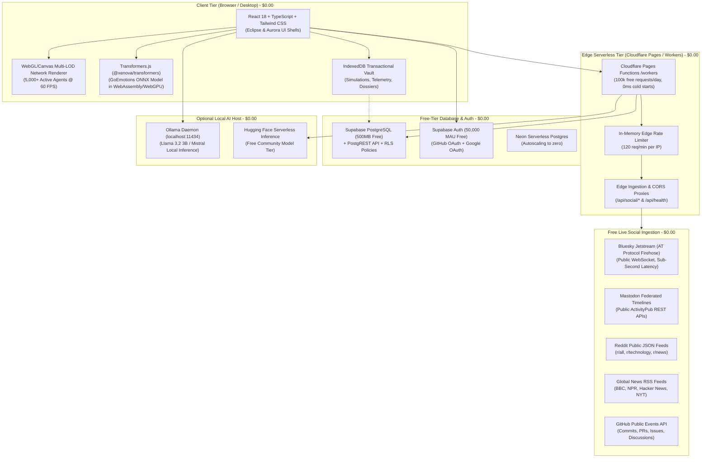

# Social Gravity — System Architecture & Zero-Cost Infrastructure

Social Gravity is a high-performance **Computational Social Psychology Engine** engineered to simulate, measure, and analyze information cascades, rumor contagion, echo-chamber polarization, and cognitive bias dynamics across synthetic and real-world multi-agent networks.

Crucially, the entire system is architected around the **Zero-Cost Production Rule**:
> Every layer—from edge compute and web hosting to database persistence, multi-platform social ingestion, and neural inference—runs exclusively on free-tier, open-source, or local-first infrastructure with an operating budget of **$0.00/month**.

---

## High-Level System Architecture

---

## Cost Budget Breakdown ($0.00 / Month)

| Layer | Service | Free Tier Allowance | Operational Mechanism | Cost |
|---|---|---|---|---|
| **Web Hosting** | Cloudflare Pages / GitHub Pages | Unlimited bandwidth, worldwide CDN | Pre-rendered static assets deployed via GitHub Actions | **$0.00** |
| **Edge Compute** | Cloudflare Workers / Pages Functions | 100,000 requests/day, 10ms CPU | Serverless proxies for CORS, rate-limiting & telemetry sync | **$0.00** |
| **Relational Database** | Supabase Free / Neon Serverless | 500MB storage, unlimited PostgREST reads | PostgreSQL schema with RLS and automated IndexedDB sync | **$0.00** |
| **Authentication** | Supabase Auth / Local Demo | 50,000 MAU free tier | GitHub OAuth, Google OAuth, and zero-config local analyst mode | **$0.00** |
| **Object Storage** | Supabase Storage / Client Vault | 1GB cloud bucket + local IndexedDB | Intelligence dossiers, snapshots & dataset uploads | **$0.00** |
| **AI Inference** | Transformers.js & Ollama | 100% free client/host compute | In-browser ONNX WebAssembly + local host Llama 3.2 | **$0.00** |
| **Social Ingestion** | AT Protocol, ActivityPub, RSS, GitHub | Free public APIs & firehoses | Jetstream WebSockets, public JSON endpoints, ETag caching | **$0.00** |
| **CI/CD** | GitHub Actions | 2,000 free runner minutes/month | Automated lint, type-check, test, build, deploy & backup | **$0.00** |
| **Monitoring** | Cloudflare Web Analytics + UptimeRobot | Unlimited privacy analytics + 50 HTTP monitors | Zero-cookie telemetry & 5-minute health check pings | **$0.00** |
| **Total** | **All Services** | **Production Grade** | **Zero Mandatory Subscriptions** | **$0.00** |

---

## Core Engine Components

### 1. Dynamic Agent Network & Physics Engine (`src/graph/`)
- Multi-agent network supporting up to 5,000 active cognitive nodes simultaneously.
- Dynamic relationship edge weighting with exponential decay and adaptive reinforcement.
- Bitwise deterministic replay engine guaranteeing 100% time-travel fidelity across timeline scrubbing.

### 2. Social Psychological Simulation Engine (`src/psychology/` & `src/simulation/`)
- Dual-process cognitive deliberation (System 1 fast heuristic vs. System 2 analytical scrutiny).
- Empirical Asch conformity pressure curves with group consensus thresholds.
- Epidemic contagion models ($R_0$ calculation, echo-chamber polarization indices, bridge node detection).
- Counter-intervention and rumor debunking inoculation mechanics.

### 3. Local-First Neural Emotion Engine (`src/nlp/`)
- Client-side inference powered by **Transformers.js** (`@xenova/transformers`).
- Implements Google's 28-category **GoEmotions** taxonomy with calibrated lexicon fallbacks for instantaneous zero-latency execution in test runners.

### 4. Zero-Cost Live Signal Manager (`src/live/`)
- Connects simultaneously to 5 free streams:
  1. **Bluesky Jetstream**: High-throughput public firehose over WebSocket.
  2. **Mastodon Timelines**: ActivityPub federated posts from public instances.
  3. **Reddit Public Feeds**: JSON feeds from targeted subreddits.
  4. **RSS Feeds**: Syndicated news from international outlets.
  5. **GitHub Public Events**: Collaborative developer activity.
- Automatic ETag 304 caching, salted SHA-256 pseudonymization, and persistent 10,000-event queue deduplication.
