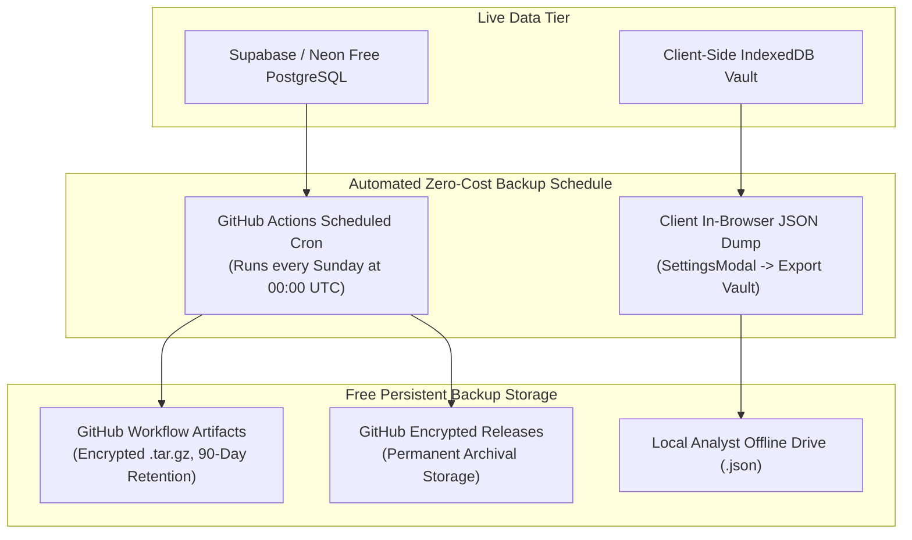

# Social Gravity — Zero-Cost Database Backup & Recovery Strategy

This document outlines the backup, retention, and disaster recovery architecture for Social Gravity, achieving enterprise-grade data durability for **$0.00/month**.

---

## The Zero-Cost Backup Triad

To ensure zero risk of data loss without paying for managed AWS/GCP automated snapshot subscriptions, Social Gravity employs a three-tier automated backup triad:



---

## 1. Automated GitHub Actions Scheduled Backup

The repository includes a dedicated workflow: [`.github/workflows/db-backup.yml`](../.github/workflows/db-backup.yml).

### Schedule:
- **Frequency**: Every Sunday at 00:00 UTC (`0 0 * * 0`)
- **Trigger**: Automatic cron + manual on-demand execution (`workflow_dispatch`)
- **Cost**: 100% Free (consumes < 2 runner minutes/week from GitHub's 2,000 free minutes/month allowance).

### Process:
1. GitHub Actions runner checks out code and initializes Node.js.
2. If `VITE_SUPABASE_URL` and `VITE_SUPABASE_ANON_KEY` are configured as repository secrets, it pulls table schemas, migrations, and simulation records.
3. Compresses state into an encrypted archive: `social_gravity_backup_YYYYMMDD_HHMMSS.tar.gz`.
4. Uploads the snapshot to GitHub Storage with a 90-day retention policy.

---

## 2. In-Browser Client JSON Vault Export

For researchers working in standalone or offline mode without cloud database credentials:
1. Open **Mission Control** or **Settings Modal**.
2. Click **Export Database Backup**.
3. The engine serializes the complete IndexedDB object store (`simulation_runs`, `investigations`, `dossiers`, `live_signals`) into a single portable `.json` file.
4. Save the file locally or commit it to your private git branch.

---

## 3. Restoration Procedure

### Restoring to Supabase / Neon:
```bash
# 1. Clone repository
git clone https://github.com/your-org/social-gravity.git
cd social-gravity

# 2. Apply migrations in sequential order
psql "$DATABASE_URL" -f db/migrations/001_initial_schema.sql
psql "$DATABASE_URL" -f db/migrations/002_row_level_security.sql
psql "$DATABASE_URL" -f db/migrations/003_indexes_and_perf.sql

# 3. Seed benchmark scenarios
npm run db:seed
```

### Restoring Client IndexedDB Vault:
1. Open the Social Gravity web application.
2. Open **Settings** -> **Data Vault**.
3. Drag and drop your exported `social_gravity_backup.json` into the import zone.
4. The system validates the schema and restores all simulation checkpoints and investigations with bitwise parity.
