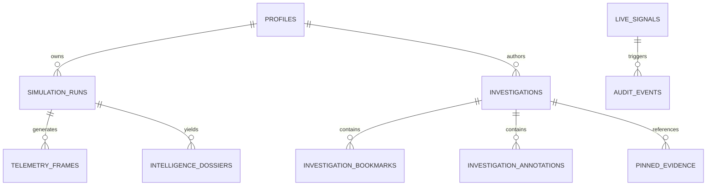

# Social Gravity — Database Schema & Data Dictionary

Social Gravity provides a production-grade relational database architecture engineered for **PostgreSQL (Supabase / Neon)** and **libSQL (Turso)** free tiers.

---

## Entity Relationship Overview

---

## Core Tables Specification

### 1. `profiles`
Stores researcher and analyst identities authenticated via GitHub OAuth or local sessions.
| Column | Type | Description |
|---|---|---|
| `id` | `UUID PRIMARY KEY` | Unique identifier (linked to `auth.users.id` in Supabase) |
| `email` | `TEXT UNIQUE` | Researcher email address |
| `display_name` | `TEXT` | Public display name |
| `role` | `TEXT` | User privilege level (`lead_researcher`, `analyst`, `observer`) |
| `created_at` | `TIMESTAMPTZ` | Profile creation timestamp |

### 2. `simulation_runs`
Stores metadata, topology parameters, and macro-sociological indices for each execution.
| Column | Type | Description |
|---|---|---|
| `id` | `TEXT PRIMARY KEY` | Unique simulation run ID (e.g. `sim-1726000000000-42`) |
| `name` | `TEXT` | Experiment name |
| `archetype` | `TEXT` | `school`, `workplace`, `city`, `online_community` |
| `seed` | `BIGINT` | Mulberry32 PRNG seed for bitwise reproducibility |
| `agent_count` | `INTEGER` | Total agents in network (e.g. 80, 150, 1000, 5000) |
| `edge_count` | `INTEGER` | Total relationship edges |
| `final_round` | `INTEGER` | Highest round executed |
| `peak_believers` | `INTEGER` | Maximum concurrent believers observed |
| `final_r0` | `NUMERIC(6,3)` | Empirical basic reproduction rate |
| `echo_chamber_index` | `NUMERIC(6,3)` | Normalized modularity & polarization metric ($0.0 \to 1.0$) |
| `resilience_score` | `NUMERIC(5,2)` | Composite societal resilience score ($0 \to 100$) |
| `parameters` | `JSONB` | Hyperparameters ($\beta, \lambda, \text{bias}$) |

### 3. `telemetry_frames`
Round-by-round time series telemetry capturing the progression of information cascades.
| Column | Type | Description |
|---|---|---|
| `id` | `TEXT PRIMARY KEY` | Frame identifier (e.g. `tf-panic-r15`) |
| `simulation_id` | `TEXT REFERENCES simulation_runs(id)` | Associated simulation |
| `round` | `INTEGER` | Discrete simulation tick ($0 \dots T$) |
| `believers_count` | `INTEGER` | Agents currently adopting rumor |
| `skeptics_count` | `INTEGER` | Agents resisting rumor |
| `uninformed_count` | `INTEGER` | Susceptible agents not yet exposed |
| `debunkers_count` | `INTEGER` | Active counter-intervention messengers |
| `network_entropy` | `NUMERIC(6,4)` | Shannon entropy of network belief distribution |

### 4. `investigations`
Collaborative workspace packages where analysts assemble forensic dossiers.
| Column | Type | Description |
|---|---|---|
| `id` | `TEXT PRIMARY KEY` | e.g. `inv-benchmark-cascade-2026` |
| `title` | `TEXT` | Investigation title |
| `status` | `TEXT` | `open`, `in_review`, `resolved`, `archived` |
| `bookmarks` | `JSONB` | Timeline scrubbing checkpoints |
| `annotations` | `JSONB` | Agent-level behavioral tags and notes |
| `pinned_evidence` | `JSONB` | Charts, telemetry slices, and centrality proofs |
| `comments` | `JSONB` | Threaded peer-review discussion comments |

### 5. `live_signals`
Real-time posts ingested from Bluesky, Mastodon, Reddit, RSS, and GitHub.
| Column | Type | Description |
|---|---|---|
| `id` | `TEXT PRIMARY KEY` | e.g. `bluesky-3lb...`, `mastodon-112...` |
| `platform` | `TEXT` | Ingestion source platform |
| `author_id` | `TEXT` | Pseudonymized author ID |
| `content` | `TEXT` | Sanitized post content |
| `sentiment_label` | `TEXT` | GoEmotions top category |
| `sentiment_score` | `NUMERIC(6,4)` | Confidence score ($0.0 \to 1.0$) |
| `timestamp` | `BIGINT` | Publication timestamp |
