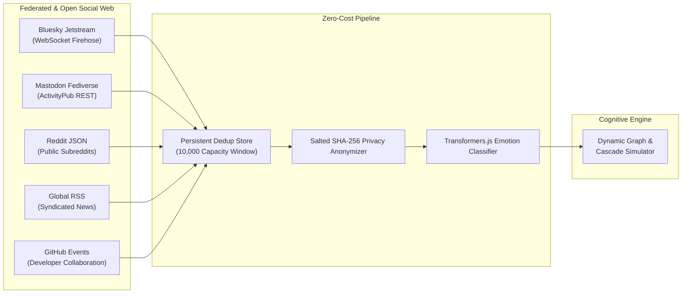

# Social Gravity — Social Data Strategy & Zero-Cost Feeds

Social Gravity rejects dependence on paywalled, expensive social media APIs (such as X's Enterprise API tier). Instead, it prioritizes **open, public, and federated protocols** that provide real-world sociological signal with $0.00 in subscription costs.

---

## Supported Free Ingestion Connectors

---

## 1. Bluesky (AT Protocol Jetstream Firehose)
- **Protocol**: Decentralized AT Protocol WebSocket.
- **Cost**: $0.00 / Free forever.
- **Endpoints**: `wss://jetstream2.us-east.bsky.network/subscribe?wantedCollections=app.bsky.feed.post`
- **Capabilities**: Ingests live global public posts with sub-second latency. Supports keyword filtering (e.g. `rumor`, `breaking`, `ai`) on the fly.

## 2. Mastodon (ActivityPub Federated Network)
- **Protocol**: W3C ActivityPub open standard.
- **Cost**: $0.00 / Free forever.
- **Endpoints**: `https://mastodon.social/api/v1/timelines/public`
- **Capabilities**: Connects to public timelines across multiple federated instances (`mastodon.social`, `hachyderm.io`, `fosstodon.org`, `mastodon.online`). Parses boosts, favourites, and hashtags.

## 3. Reddit (Public Subreddit Feeds)
- **Protocol**: Public HTTP JSON endpoints.
- **Cost**: $0.00 / Free tier.
- **Endpoints**: `https://www.reddit.com/r/{subreddit}/hot.json`
- **Capabilities**: Ingests top and controversial discussions across communities (e.g. `r/technology`, `r/worldnews`, `r/science`). Respects standard Reddit caching headers.

## 4. Global RSS News Feeds
- **Protocol**: XML / Atom Syndication.
- **Cost**: $0.00 / Free.
- **Capabilities**: Ingests breaking news headlines from major international outlets (BBC, Reuters, Hacker News, NYT, The Guardian). Employs ETag and `Last-Modified` HTTP 304 caching to minimize network usage.

## 5. GitHub Public Activity Stream
- **Protocol**: GitHub REST API v3 Events.
- **Cost**: $0.00 / Free.
- **Endpoints**: `https://api.github.com/events`
- **Capabilities**: Streams real developer collaboration dynamics—commits, pull requests, issue debates, and comments—enabling simulation of technical consensus and software vulnerability awareness cascades.

---

## Privacy & Ethical Compliance

1. **Deterministic Pseudonymization**: All usernames and user handles are salted and hashed via SHA-256 (`src/live/authorHash.ts`) before being ingested into the graph simulation.
2. **Strict Text Sanitization**: Mention tags, emails, and sensitive metadata are scrubbed in memory.
3. **No Private Scraping**: Only explicitly public, unauthenticated feeds are queried. Private profiles, DMs, or login-walled content are never accessed.
4. **Resilient Degradation**: If any feed encounters a network error, rate limit, or CORS restriction, the engine automatically falls back to local synthetic agents without interrupting live simulation.
